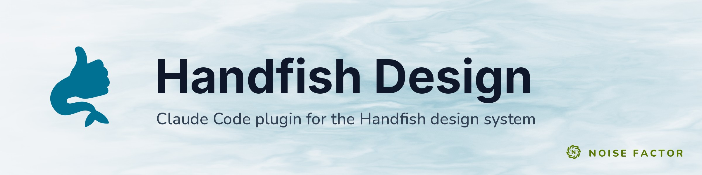

<!-- repo-hero -->
<a href="https://handfish.noisefactor.io/"></a>

<sub>Open source from <a href="https://noisefactor.io">Noise Factor</a> &middot; <a href="https://github.com/noisefactorllc">more projects</a></sub>

# Handfish Design

A Claude Code plugin for the [Handfish Design System](https://handfish.noisefactor.io). Handfish provides Web Components and OKLCH design tokens for Noisedeck, Tetra, and other Noise Factor products.

The plugin teaches light-DOM style injection, `--hf-*` token use, form-associated components, and the 17-theme system. It prevents common mistakes with hardcoded colors, `!important`, Shadow DOM workarounds, and event semantics.

## What it does

- **Loads handfish conventions on demand**: Claude loads relevant references when you work on an app that imports `handfish` or uses `--hf-*`.
- **Enforces token discipline**: catches hardcoded colors, spacings, radii, and shadows. Rewrites them to design tokens.
- **Knows the component catalog**: 21 custom elements, the AboutDialog class, and the toast, tooltip, escape, and keyboard-shortcut utilities. The references cover tag names, events, attributes, and form-association behavior. Tests check the catalog against handfish. See "Staying current" below.
- **Guides theme switching**: 17 theme stylesheets covering 20 `data-theme` values (some files declare both dark/light variants), plus the two default modes. The skill knows how each one re-skins the token layer.
- **Models the styling layer correctly**: handfish injects styles into the document head — components participate in the global cascade. The skill teaches override-by-specificity instead of `!important` or Shadow DOM hacks.
- **Bridges color spaces**: directs Claude to existing utilities for RGB / HSV / OkLab / OKLCH / hex conversion.
- **Walks contributors through adding a new component**: directory layout, style injection pattern, exports, examples page, visual regression baselines.

## Install

```
/plugin marketplace add noisefactorllc/handfish-design
/plugin install handfish-design@noisefactor
```

Or require it for your team by adding to `.claude/settings.json`:

```json
{
  "extraKnownMarketplaces": {
    "noisefactor": {
      "source": {
        "source": "github",
        "repo": "noisefactorllc/handfish-design"
      }
    }
  },
  "enabledPlugins": {
    "handfish-design@noisefactor": true
  }
}
```

## When it activates

The skill triggers whenever Claude is doing web work that touches:

- Imports from `handfish` or `@noisedeck/handfish`
- `--hf-*` CSS variables in stylesheets or inline styles
- Any handfish custom element: `<toggle-switch>`, `<slider-value>`, `<select-dropdown>`, `<dropdown-menu>`, `<dropdown-item>`, `<color-picker>`, `<color-wheel>`, `<color-swatch>`, `<gradient-stops>`, `<vector2d-picker>`, or `<vector3d-picker>`. This also includes `<justify-button-group>`, `<code-editor>`, `<image-magnifier>`, `<knob-dial>`, `<led-matrix>`, `<tempo-bar>`, `<menu-bar>`, `<seance-dialog>`, `<session-status>`, and `<join-session-dialog>`.
- The `AboutDialog` JS class (constructed with `new AboutDialog({...})`, then `.show()`)
- Toast helpers (`showToast`, `showSuccess`, `showError`, `showWarning`, `showInfo`)
- Tooltip initialization (`initializeTooltips`, `class="tooltip"` + `data-title` attribute)
- The escape stack (`registerEscapeable`, `unregisterEscapeable`, `initEscapeHandler`)
- Keyboard-shortcut formatting (`formatShortcut`, `isMacPlatform`)
- Color conversion utilities (`rgbToHex`, `parseHex`, `rgbToHsv`, OkLab/OKLCH math)
- Right-to-left / bidi work: `dir="rtl"` on a handfish page, `data-language="industrial"`, or overriding a component's built-in strings
- Frontend code in any Noisemaker-based app (Noisedeck, Tetra, Foundry, Polymorphic, Layers, Shade, Blaster, ShuffleSet, Sleeve, Remap, Handfish itself)

## Reference docs

The plugin includes domain-specific reference documents that Claude loads contextually:

| Reference | Covers |
|-----------|--------|
| `setup.md` | CDN URLs, importmap pattern, three pinning levels (`/0`, `/0.10`, `/0.10.1`), font preloading, base styles, the `industrial.css` typeface opt-in, RTL setup |
| `tokens.md` | The full `--hf-*` token catalog, OKLCH color format, semantic vs. primitive tokens, the `--hf-led-*` readout palette, why hardcoding breaks themes |
| `theming.md` | The 17 built-in themes, `data-theme` switching, building a custom theme, dark/light variants, preventing FOUC, and the theme / language / direction axes |
| `components.md` | Hand-written prose for the 21 custom elements + AboutDialog class + helper utility families: usage patterns, examples, gotchas, anti-patterns |
| **`api-canonical.md`** | **Machine-generated source-of-truth reference** — attribute names, event types, event detail payloads, form-association status, toast defaults. Generated deterministically from handfish source, checked by `npm run check`. Wins when it disagrees with `components.md`. |
| `styling.md` | Light-DOM style injection model, overriding component styles by specificity, logical vs. physical CSS for RTL, why `!important` and Shadow DOM workarounds are banned |
| `i18n.md` | Bidi/RTL support, `dir`, overridable strings, logical CSS, and `<bdi>` isolation. Handfish provides component support. Apps provide translations. |
| `color.md` | Color conversion utilities (`rgbToHex`, `parseHex`, OkLab/OKLCH math), the 0–255 vs OKLCH conventions |
| `utilities.md` | Toasts (defaults, real options, `dismissLabel`), the stack-based escape handler, tooltip initialization (`class="tooltip"` + `data-title`), platform-aware shortcut formatting (`formatShortcut`) |
| `contributing.md` | Adding a new component to handfish itself + the canonical-reference regeneration workflow for skill maintainers |

## Staying current

The last API audit was **2026-08-12**, against **handfish `0.10`** at HEAD commit [`9bbb287`](https://github.com/noisefactorllc/handfish/commit/9bbb287). It covered all industrial components (`knob-dial`, `led-matrix`, `tempo-bar`), `menu-bar`, and the Seance components (`seance-dialog`, `session-status`, `join-session-dialog`). It also covered code-editor collaboration APIs, bidi/RTL support, and `shortcuts` utilities. The generated `references/api-canonical.md` records separate provenance. Its JSON last changed at commit [`d8d350c`](https://github.com/noisefactorllc/handfish/commit/d8d350c) on 2026-07-28, when the extracted API last changed.

handfish ships components independently of this repo. This repo does not
update automatically when handfish ships, so the plugin can teach Claude a
catalog missing a third of the library. Checks cover both surfaces that can drift:

- `references/api-canonical.md` — generated from handfish's machine-extracted
  `docs/component-api.json`.
- The `description` frontmatter in `skills/handfish-design/SKILL.md` — the
  activation trigger. A tag missing here means nobody working on that
  component gets handfish guidance at all.

```bash
npm test          # both drift checks, plus the generator's own behaviour
npm run check     # is api-canonical.md current? (read-only, exits non-zero if not)
npm run regenerate
```

The drift checks need a sibling handfish checkout at `../handfish`. Without one,
they skip, so the suite still runs standalone. The CI `test` job gates changes
to this repo with the drift checks skipped. Thus, a handfish release cannot
fail an unrelated PR. A separate weekly `drift` job clones handfish and runs
the checks live.

The generator produces byte-identical output for the same input. Provenance
comes from git rather than a wall clock. An empty diff therefore means
nothing changed, which makes the check possible.

When handfish ships something new:

1. `cd ../handfish && git pull && node scripts/generate-component-api.js`
2. Run `npm run regenerate` here. Review the diff.
3. Add any new tags to the `description` in `SKILL.md` (`npm test` names the
   missing ones).
4. Update prose in `components.md` for anything whose API changed.

See `skills/handfish-design/references/contributing.md` § "Maintaining this
skill" for the full workflow.

## License

MIT
